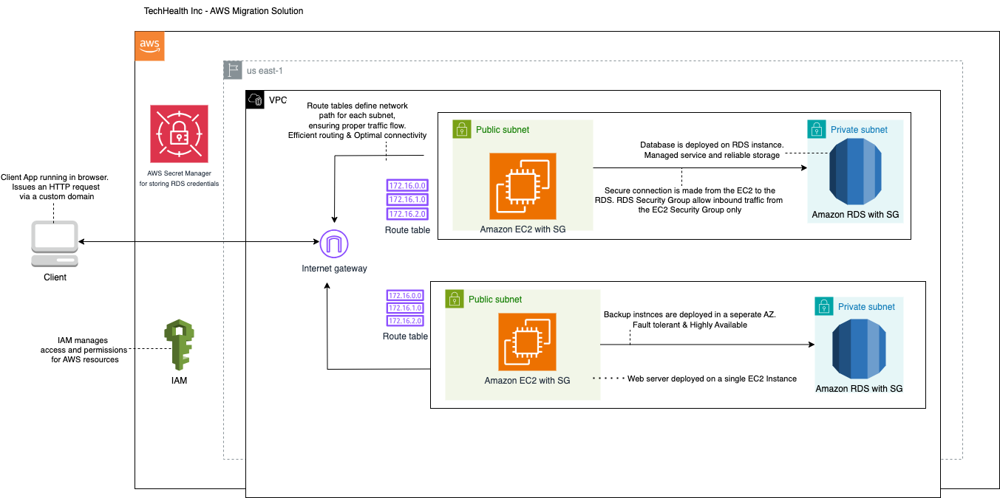
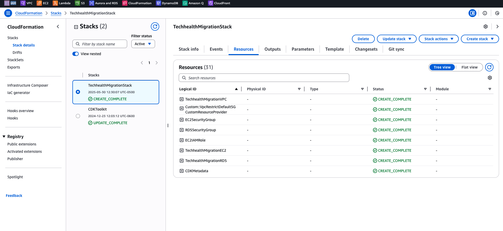
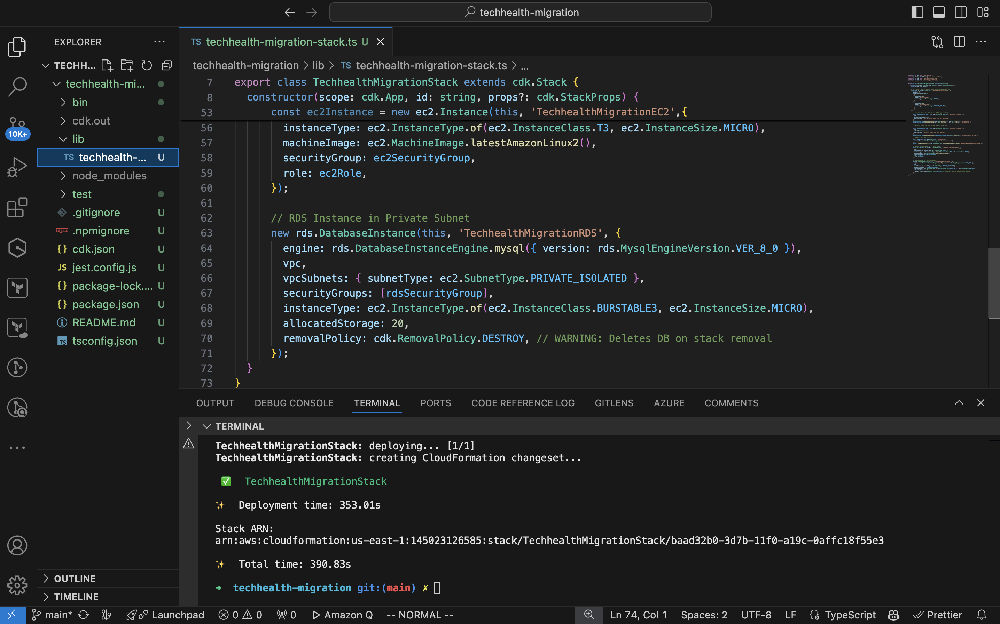

# TechHealth Inc. Infrastructure Migration Project

## Project Overview

This project demonstrates the migration of TechHealth Inc.'s manually-created AWS infrastructure to Infrastructure as Code (IaC) using AWS CDK with TypeScript. The migration addresses critical infrastructure management challenges while implementing AWS best practices for security, networking, and cost optimization.

## Client Background

**TechHealth Inc.** is a healthcare technology company that built their AWS infrastructure manually through the AWS Console 5 years ago. Their patient portal web application required modernization and migration to Infrastructure as Code to address several operational challenges.

### Problem Statement

- **Manual Infrastructure Management**: All resources created via AWS Console
- **No Version Control**: Infrastructure changes weren't tracked or versioned
- **Environment Replication Issues**: Difficult to create consistent environments
- **Change Tracking Problems**: No visibility into who made infrastructure changes
- **Outdated Documentation**: Infrastructure documentation was not maintained
- **Poor Network Segmentation**: All resources in public subnets without proper isolation
- **No Automated Testing**: Infrastructure changes couldn't be tested systematically

## Architecture Design

### Current Architecture


The new architecture implements AWS best practices with the following components:

### Network Architecture
- **VPC**: Custom VPC spanning 2 Availability Zones (us-east-1)
- **Public Subnets**: One per AZ for internet-facing resources
- **Private Subnets**: One per AZ for database tier (isolated subnets)
- **Internet Gateway**: Provides internet access to public subnets
- **Route Tables**: Separate routing for public and private subnet traffic

### Security Architecture
- **EC2 Security Group**: Allows SSH (port 22) and HTTP (port 80) access
- **RDS Security Group**: Allows MySQL traffic (port 3306) only from EC2 security group
- **Network Isolation**: Database tier completely isolated from direct internet access
- **IAM Role**: EC2 instance has minimal required permissions with SSM access

### Compute & Database Tier
- **EC2 Instance**: t3.micro instance in public subnet for web application
- **RDS Instance**: db.t3.micro MySQL 8.0 in private subnet for patient data
- **Multi-AZ Setup**: Resources distributed across multiple availability zones for resilience

## Implementation Details

### Technology Stack
- **Infrastructure as Code**: AWS CDK with TypeScript
- **Cloud Provider**: Amazon Web Services (AWS)
- **Database**: MySQL 8.0 on Amazon RDS
- **Compute**: Amazon EC2 with Amazon Linux 2
- **Networking**: Amazon VPC with public/private subnet architecture

### Key CDK Components

```typescript
// VPC with proper subnet configuration
const vpc = new ec2.Vpc(this, 'TechhealthMigrationVPC', {
  maxAzs: 2,
  subnetConfiguration: [
    {
      cidrMask: 24,
      name: 'PublicSubnet',
      subnetType: ec2.SubnetType.PUBLIC,
    },
    {
      cidrMask: 24,
      name: 'PrivateSubnet',
      subnetType: ec2.SubnetType.PRIVATE_ISOLATED,
    },
  ],
});
```

### Security Implementation

1. **Network Segmentation**
   - Database tier isolated in private subnets
   - Application tier in public subnets with controlled access
   - No direct internet access to database

2. **Security Groups (Least Privilege)**
   - EC2: SSH (22) and HTTP (80) only
   - RDS: MySQL (3306) from EC2 security group only
   - No unnecessary ports exposed

3. **IAM Roles**
   - EC2 instance with minimal required permissions
   - AWS Systems Manager access for secure management

## Cost Optimization

### Implemented Cost-Saving Measures
- **EC2 Instance**: t3.micro (free tier eligible)
- **RDS Instance**: db.t3.micro (minimum cost option)
- **No NAT Gateway**: Using isolated subnets instead of private subnets with NAT
- **Storage**: 20GB allocated storage (minimum required)
- **Removal Policy**: Resources tagged for easy cleanup

### Estimated Monthly Costs
- **EC2 t3.micro**: $0 (free tier) or ~$8.50/month
- **RDS db.t3.micro**: ~$12.60/month
- **VPC Components**: $0 (no NAT Gateway)
- **Storage**: ~$2.30/month (20GB GP2)
- **Total Estimated**: ~$15-23/month

## Setup Instructions

### Prerequisites
- AWS CLI configured with appropriate credentials
- Node.js (v18 or later)
- AWS CDK CLI installed (`npm install -g aws-cdk`)
- TypeScript installed (`npm install -g typescript`)

### Installation Steps

1. **Clone the Repository**
   ```bash
   git clone <repository-url>
   cd techhealth-migration
   ```

2. **Install Dependencies**
   ```bash
   npm install
   ```

3. **Configure AWS Profile**
   ```bash
   aws configure
   # Enter your AWS Access Key ID, Secret Access Key, and region
   ```

4. **Bootstrap CDK (First time only)**
   ```bash
   cdk bootstrap
   ```

5. **Deploy the Stack**
   ```bash
   cdk deploy
   ```

6. **Verify Deployment**
   - Check AWS Console for created resources
   - Test EC2 to RDS connectivity

### Cleanup Instructions

**⚠️ IMPORTANT: Always destroy resources after testing to avoid charges**

```bash
cdk destroy
```

Confirm the deletion when prompted to remove all resources.

## Testing Evidence

### Successful Deployment

- Stack deployed successfully with all 31 resources created
- All resources show `CREATE_COMPLETE` status
- No deployment errors or rollbacks

### Resource Verification

- CDK deployment completed successfully
- Total deployment time: 390.83 seconds
- Stack ARN confirms successful creation in us-east-1

### Infrastructure Components Created
1. TechhealthMigrationVPC
2. EC2SecurityGroup
3. RDSSecurityGroup  
4. EC2IAMRole
5. TechhealthMigrationEC2
6. TechhealthMigrationRDS
7. Custom VPC, Route Tables, and Subnets

## Design Decisions & Rationale

### Network Design
- **Two Availability Zones**: Provides high availability and fault tolerance
- **Private Isolated Subnets**: Maximum security for database tier (no internet route)
- **Public Subnets**: Necessary for web application internet access
- **No NAT Gateway**: Cost optimization measure (database doesn't need internet access)

### Security Design
- **Security Group Rules**: Implemented least privilege access
- **Database Isolation**: RDS only accessible from application tier
- **IAM Roles**: Minimal permissions with SSM for secure access
- **No NACLs**: Security groups provide sufficient granular control

### Instance Sizing
- **t3.micro Instances**: Balance of cost and performance for development/testing
- **MySQL 8.0**: Latest stable version with security improvements
- **20GB Storage**: Minimum allocation for cost optimization

## Lessons Learned

### Technical Insights
1. **CDK Benefits**: Type-safe infrastructure code with IntelliSense support
2. **Subnet Types**: Understanding PRIVATE_ISOLATED vs PRIVATE_WITH_EGRESS importance
3. **Security Groups**: More flexible than NACLs for dynamic rule management
4. **Resource Dependencies**: CDK automatically handles resource creation order

### Best Practices Implemented
- **Infrastructure as Code**: All infrastructure defined in version-controlled code
- **Least Privilege**: Security groups follow minimal access principles  
- **Multi-AZ Design**: Resources distributed for high availability
- **Cost Awareness**: Deliberate choices to minimize costs while maintaining functionality

### Challenges Overcome
- **Database Connectivity**: Ensuring EC2 can reach RDS through security group rules
- **Subnet Configuration**: Understanding different subnet types and their routing
- **Resource Cleanup**: Implementing proper removal policies for easy teardown

## Security Considerations

### Network Security
- Database tier has no direct internet access
- Application tier protected by security groups
- Traffic flow controlled through security group rules

### Access Control
- EC2 instance accessible only via SSH key
- Database credentials managed by AWS RDS
- IAM roles follow principle of least privilege

### Data Protection
- RDS instance in private subnet prevents direct access
- Security groups provide defense in depth
- Automated backups enabled (RDS default)

## Future Enhancements

### Potential Improvements
1. **Application Load Balancer**: For high availability and SSL termination
2. **Auto Scaling**: Automatic scaling based on demand
3. **CloudWatch Monitoring**: Comprehensive monitoring and alerting
4. **AWS Secrets Manager**: Secure database credential management
5. **VPC Endpoints**: Private connectivity to AWS services
6. **WAF Integration**: Web application firewall for additional security

### Production Considerations
- **Multi-Region Deployment**: Cross-region disaster recovery
- **Database Encryption**: At-rest and in-transit encryption
- **Backup Strategy**: Automated backups with point-in-time recovery
- **CI/CD Pipeline**: Automated testing and deployment

## Conclusion

This project successfully demonstrates the migration from manual infrastructure management to Infrastructure as Code using AWS CDK. The implementation addresses TechHealth Inc.'s operational challenges while introducing AWS best practices for security, networking, and cost optimization.

The new architecture provides:
- **Reproducible Infrastructure**: Consistent environment creation through code
- **Version Control**: All changes tracked and reviewable
- **Security Improvements**: Proper network segmentation and access controls
- **Cost Optimization**: Efficient resource utilization
- **Operational Excellence**: Foundation for automated operations and monitoring

---

## Project Files Structure

```
techhealth-migration/
├── lib/
│   └── techhealth-migration-stack.ts
├── bin/
│   └── techhealth-migration.ts
├── docs/
│   ├── architecture-diagram.png
│   ├── cloudformation-stack.png
│   └── vscode-deployment.png
├── test/
│   └── techhealth-migration.test.ts
├── README.md
├── package.json
├── tsconfig.json
└── cdk.json
```

## Contact

If you have any questions or would like to connect, please feel free to reach out to me https://www.linkedin.com/in/kayode-ishola-6440699b/.

---

**⚠️ Remember to run `cdk destroy` after testing to avoid ongoing AWS charges!**